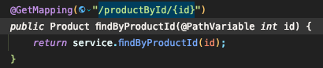
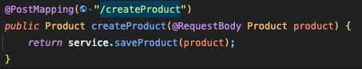

# SpringBoot, MySQL, JPA, Hibernate RestFul CRUD API

-------------------------------------------------------

### 📌 개요

+ SpringBoot, JPA, Hibernate를 활용한 CRUD API

-------------------------------------------------------

### 📌 주요 어노테이션(Annotation)

* @Data
    * @Getter, @Setter, @RequriedArgsConstructor, @ToString, @EqualsAndHashCode을 한껀번에 설정 해주는 어노테이션

* @AllArgsConstructor
    * 모든 필드 값을 파라미터로 받는 생성자를 만들어주는 어노테이션
* @NoArgsConstructor
    * 파라미터가 없는 기본 생성자를 생성해주는 어노테이션
* @Autowired
    * 필요한 의존 객체의 "타입(Type)"에 해당하는 빈(Bean)을 찾아 주입해주는 어노테이션
  > 1) 생성자
  >2) setter
  >3) 필드
    * 위의 3가지의 경우에만 사용 가능하다.
    * 기본값이 true이기 때문에 의존성 주입을 할 대상을 찾지 못한다면 구동이 실패한다.
* @PathVariable
    * HTTP 요청에 대해 매칭되는 request parameter값이 자동으로 들어오는 어노테이션
      
* @RequestParam
    * HTTP Get 요청에 대해 매칭되는 request parameter값이 자동으로 들어오는 어노테이션
* @RequestBody
    * HTTP Post 요청에 대해서만 처리하는 어노테이션
        * HTTP Post 요청에 대해 Request body에 있는 request message에서 값을 얻어와 매칭한다.
      

